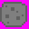
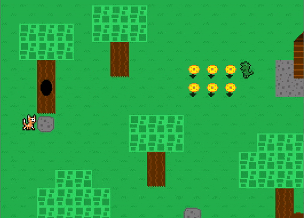

## Table of contents
{: .no_toc .text-delta }

1. TOC
{:toc}

---

# Enhanced Map Tiles

## What is an enhanced map tile?

An enhanced map tile (represented by the `EnhancedMapTile` class in the `Level` package) is a `MapEntity` subclass. The idea behind
this class is that it acts just like a `MapTile` does in every way, but with the ability to define its own `update` and `draw` logic
instead of just going with the `MapTile's` default logic. This allows a map tile to essentially do whatever it wants while still
being counted as a map tile, meaning the `Player` will still consider it during its collision checks based on the `EnhancedMapTile's` tile type. Like
every `MapEntity` subclass, an `EnhancedMapTile` during its `update` cycle will be given a reference to the `Player` instance,
so it is able to interact with the player directly.

And yes, I know the name "enhanced map tile" is dumb, I couldn't think of a better name to describe these at the time and now I'm over it.

## Enhanced Map Tile Subclass

In the `EnhancedMapTiles` package, there is currently one subclasses of the `EnhancedMapTile` class -- `Rock`.
The `Rock` class defines an enhanced map tile in the game, which can be seen in the `TestMap` map.

## Adding a new enhanced map tile to the game

This is simple -- create a new class in the `EnhancedMapTiles` package, subclass the `EnhancedMapTile` class, and then just implement
desired logic from there. I recommend copying an existing enhanced map tile class as a "template" of sorts to help set up and design the enhanced map tile.

## Adding an enhanced map tile to a map

In a map subclass's `loadEnhancedMapTiles` method, enhanced map tiles can be defined and added to the map's enhanced map tile list. For example, in `TestMap`,
a `Rock` is created and added to the enhanced map tile list:

```java
@Override
public ArrayList<EnhancedMapTile> loadEnhancedMapTiles() {
    ArrayList<EnhancedMapTile> enhancedMapTiles = new ArrayList<>();
    enhancedMapTiles.add(new Rock(getMapTile(2, 7).getLocation()));
    return enhancedMapTiles;
}
```

## Enhanced map tiles currently in game

### Rock



This enhanced map tile is defined by the `Rock` class. It is what it sounds like -- a rock.
The rock can be pushed around by the player.

Not going to lie, getting this to work was a lot tougher than I expected, and required a ton of fine-tuning
to ensure pushing the rock went in the correct direction. And there were a bunch of other odd bugs.
But I'm very happy with it now -- pushing blocks out of the way is a staple of this gaming genre!



The image file for the green platform is `Rock.png`.

