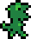

## Table of contents
{: .no_toc .text-delta }

1. TOC
{:toc}

---

# NPCs

## What is an NPC?

An NPC (**n**on-**p**layer **c**haracter) (represented by the `NPC` class in the `Level` package) is a `MapEntity` subclass. 
An NPC can be given its own graphics/animations, as well as its own `update` cycle which defines its behavior.

NPCs in a game tend to act as a neutral character, meaning they usually do not harm the player and are meant to supplement the traversal through a level and also
improve overall game immersion.

Typically, an NPC is given an `interactScript` which will execute when the player interacts with them.
This can be seen with both the walrus and dinosaur NPCs in the game currently. Read more about scripts [here](./scripts.md).

Creating interact scripts for NPCs is one of the main ways this game functions and carries out the story.
An NPC can be made to do any desired behavior, and is not just limited to interact scripts, but it is up to the coder's skills to achieve their desired behavior!

## NPC Subclass

In the `NPCs` package, there are currently only two subclass of the `NPC` class -- `Walrus` and `Dinosaur`.
Both NPCs can be seen in the `TestMap` map.

## Adding a new NPC to the game

This is simple -- create a new class in the `NPCs` package, subclass the `NPC` class, and then just implement
desired logic from there. I recommend copying an existing npc class as a "template" of sorts to help set up and design the npc.

## Adding an NPC to a map

In a map subclass's `loadNPCs` method, NPCs can be defined and added to the map's NPC list. For example, in `TestMap`,
a `Walrus` class instance is created added to the NPC list:

```java
@Override
public ArrayList<NPC> loadNPCs() {
    ArrayList<NPC> npcs = new ArrayList<>();

    Walrus walrus = new Walrus(1, getMapTile(4, 28).getLocation().subtractY(40));
    walrus.setInteractScript(new WalrusScript());
    npcs.add(walrus);
    
    // ...
}
```

## NPCs currently in game

### Walrus


This NPC is defined by the `Walrus` class. In addition being the best made piece of art you have ever laid your eyes on,
the walrus is able to be interacted with. Its `interactScript` is defined in the `WalrusScript` class (located in the `Scripts.TestMap` package).
Read more about scripts [here](./scripts.md).
The walrus doesn't do much except wait around to be talked to.

The image file for the walrus is `Walrus.png`.

### Dinosaur



This NPC is defined by the `Dinosaur` class. Like the walrus, it doesn't do much other than wait for the player to interact with it.
Its `interactScript` is defined in the `DinoScript` class (located in the `Scripts.TestMap` package).
The `DinoScript` is the most complex script in the game. Understanding it is the key to mastering the scripting system
and being create to do whatever you want in this game. Read more about scripts [here](./scripts.md).

The dinosaur also has a walking animation, which is used during its `DinoScript` to force it to walk to a certain location.


## NPC Id

The constructor for an `NPC` class instance requires an `id` value. This should be a unique number for each NPC in as map.
This allows NPC's to be identifiable, which is useful in situations where you would want to move an NPC on the map
in a script, even if you aren't interacting with them. `TestMap` simply uses an id value of 0 for the walrus and 1 for the dinosaur,
and if more NPCs were to be added, it would just increment from there.

## NPC Methods

The `NPC` class defines several methods that are meant to be used in scripts to force the NPC to perform a specific behavior.
These are `facePlayer`, `stand`, and `walk`.

Calling an NPC's `facePlayer` method will cause them to set their direction to "face" the player.
This is nice to use in an NPC's `interactScript` for immersion purposes, as it looks a lot better if the NPC being interacted with
turns and faces the player.

The `stand` method changes the NPC's animation to STAND_LEFT or STAND_RIGHT. The NPC must have those animations defined in order to use this method.

The `walk` method moves the NPC in a specified direction and at a specified speed. It will also change the NPC's animation to the appropriate walking animation -- WALK_LEFT or WALK_RIGHT -- based on
which direction they were told to walk in and which direction they are facing. The NPC must have those animations defined in order to use this method.

These methods are very useful in scripts, but manipulating an NPC can be done outside of these methods as well if some special logic
is necessary. 
