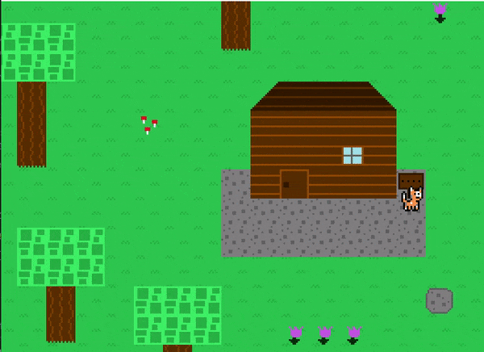
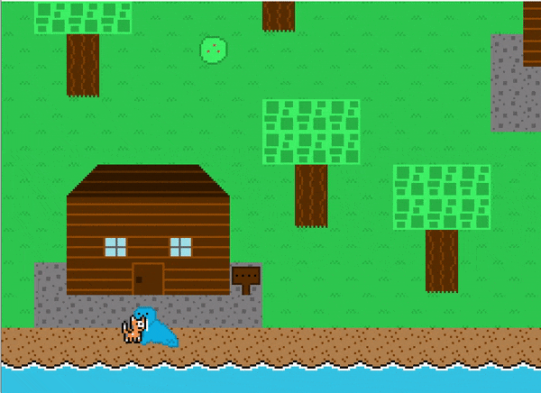
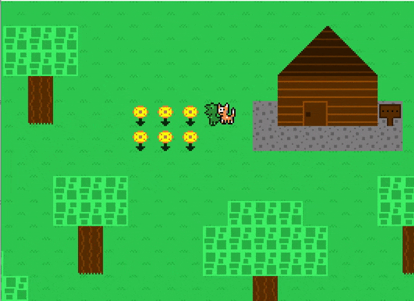

## Table of contents
{: .no_toc .text-delta }

1. TOC
{:toc}

---

# Scripts

## What is a script?

A script (represented by the `Script` class in the `Level` package) is an abstract class that allows for an "event" to be constructed and later executed.
For those of you that took SER120 here at Quinnipiac or are familiar with Java Swing components, you can think of a script like how you would code a `JButton's` click event.
The idea is that a script contains code that should be executed at a later time, but the code needs to be defined up front in order for the game to use it.

Nearly all games of this genre have some sort of scripting engine that can almost be thought of as its own "language".
Essentially, it's the game's job to execute a given script, without knowing what the script is going to do ahead of time or what the script is capable of doing.
Now, for this game, I didn't need to make things too complicated -- the scripts are just typical Java code sectioned off into separate classes
that can be assigned to map entities (as interact scripts for [NPCs](./npcs.md)/[Map Tiles](./map-tiles-and-tilesets.md) and trigger scripts for [Triggers](./triggers.md)).
The same script can be assigned to any number of entities if desired to have each one execute the same event.

Understanding this game's scripting "engine" is the key to being able to do...well anything that you want to the game.
The game is built around interact scripts and trigger scripts, so being able to make your own scripts or edit the existing scripts gives you infinite power (well...within the confines of this Java game).
Script events can be made to technically do "anything" to the game, it's just up to the coder's skill level and determination to make it happen!

## Execution

The game engine will handle script execution when it comes to interact scripts and trigger scripts associated with map entities.
The engine will pick up on when the time has come for a script to be executed (such as interacting with an NPC that has an `interactScript`), and will
include the script's execution in the update cycle until it has completed. The current script being executed is considered the "active script".

Note that scripts do NOT "pause" the rest of the game.
This was done intentionally to allow for things like animated tiles to not freeze in place, etc. While this did make things a bit more complicated,
the end result lends to a much better made game. All scripts will typically use the `lockPlayer` option to prevent the player from moving or interacting with something else until the currently active script has finished executing.

## Script State

While a script is active, there are two states it can be in: `RUNNING` and `COMPLETED`. These are defined in the `ScriptState` enum in the `Level` package.
Essentially, it gives each script full control over telling the game when it has finished executing. The game will continually be calling the script's update cycle while it is active,
so the script will continually be responding each update cyle by telling the game it is either still running (sending back a `ScriptState.RUNNING` response) or that it has finished (sending back a `ScriptState.COMPLETED` response).
As long as a script eventually returns a `COMPLETED` response, the game will eventually deactivate the script and continue on like normal afterwards.

## How to create a script

The `Script` class is abstract, meaning it must be subclassed. Currently, the game has several `Script` subclasses
located in the `Scripts.TestMap` package. The reason all scripts aren't just thrown into the generic `Scripts` package is that
scripts tend to be separate out by map, and while there is only one map `TestMap` in this game currently, I wanted to make it easier for
other developers to organize their scripts for the future. As a result, all scripts that are used in the `TestMap` map belong in the `Scripts.TestMap` package.

There is one `Script` subclass, however, that IS inside the generic `Scripts` package: `SimpleTextScript`.
I decided that this script is simple and generic enough that it could be used in many different maps. 
It is up to the developer if a script belongs to a map, or is generic and reusable enough to be used across multiple maps.

More on what these `Script` subclasses actually do is gone into detail later on this page.

To create a new script, make a new class and extend from `Script`. I recommend using the `SimpleTextScript` class as a base template.
At a minimum, each script should have the following three methods:
- `setup` -- logic that gets run before event execution
- `cleanup` -- logic that gets run after event execution
- `execute` -- logic that gets run during event execution; this is the actual "event" being carried out.

## How to attach a script to a map entity

Scripts can be attached to any [NPC](./npcs.md), [MapTile](./map-tiles-and-tilesets.md), or [EnhancedMapTile](./enhanced-map-tiles.md) class instance as an "interact script".
This means the script will become active and execute when the player interacts with the entity.
A map subclass handles attaching scripts to its entities. For example, in the `TestMap` map subclass in its `loadNPCs` method,
it creates the `Walrus` NPC and then calls its `setInteractScript` method to assign it an interact script.
The interact script it assigns to this NPC is the `WalrusScript` class, which is a script subclass found in the `Scripts.TestMap` package.

```java
Walrus walrus = new Walrus(1, getMapTile(4, 28).getLocation().subtractY(40));

// walrus's interact script is set here
walrus.setInteractScript(new WalrusScript());

npcs.add(walrus);
```

Scripts can also be attached to any [Trigger](./triggers.md) class instance as a "trigger script". This means that the script will become active
when the player activates the trigger by walking on top of it. Triggers have a `setTriggerScript` method that can be used,
but typically the script is passed into its constructor.

```java
triggers.add(new Trigger(790, 1030, 100, 10, new LostBallScript(), "hasLostBall"));
```

## How to create a script event

Once you have a script subclass, you are free to have it perform...well any event logic you want. 
It's extremely customizable, as any script event is capable of doing anything it wants to the game, such as bringing up a textbox, moving NPCs, changing map tiles, etc.

Let's break down the `SimpleTextScript` to start, which is a script subclass located in the `Scripts` package.
It is the simplest script in the game. All it does is bring up a [textbox](#Textbox) that displays specified text, and the ends.
This script is used on the several sign map tiles in the game as interact scripts.



In every script, the `execute` method is the actual "event" being carried out, so let's look at that first.

```java
 @Override
public ScriptState execute() {
    // call setup code
    start();

    // while textbox is not finished displaying all text, script keeps running
    if (!isTextboxQueueEmpty()) {
        return ScriptState.RUNNING;
    }

    // call cleanup code
    end();

    // script ends
    return ScriptState.COMPLETED;
}
```

Typically, a script will need to "set up" some stuff before executing the main event. To do this, a script makes a call to the `start` method, which you can see is the first line of code inside this script's `execute` method.
The base `Script` class ensures that this setup step is only carried out once, otherwise it would get called every update cycle and the script would keep repeating its setup step and never make progress.
After performing this logic, the base `Script` class will then call the `setup` method. Since all scripts, including `SimpleTextScript`, override the `setup` method, it will run the logic inside the subclass's method.

The `SimpleTextScript` class's `setup` method looks like this:

```java
@Override
protected void setup() {
    lockPlayer();
    showTextbox();
    addTextToTextboxQueue(textItems);
}
```

The base `Script` class has a ton of useful methods included that allows a script subclass's event to perform certain actions without needing to code them from scratch.
The provided event methods in `Script` class are detailed later in this page [here](#Event Methods).
The above `setup` method uses three of these aforementioned methods.

The first method it calls is `lockPlayer`, which "locks" the player in place and prevents them from moving around and doing other normal game actions.
This is ideal, as you don't want the player to be able to walk away from a script executing, or potentially break the game by interacting with an entity while another entity's script is currently executing.

Next, `showTextbox` will show the textbox on screen (which you can see happen in the below gif):


Finally, the `addTextToTextboxQueue` method will add text to the textbox's queue, which is what tells it what text it is going to need to display.
More detailed information on how the textbox works can be found later on this page [here](#Textbox).

Now that the setup step is complete, the `execute` method continues on:

```java
 @Override
public ScriptState execute() {
    // call setup code
    start();

    // while textbox is not finished displaying all text, script keeps running
    if (!isTextboxQueueEmpty()) {
        return ScriptState.RUNNING;
    }

    // call cleanup code
    end();

    // script ends
    return ScriptState.COMPLETED;
}
```

After the `start` method call, the next part of the script's event essentially just waits until the player has finished
going through every text item that the textbox needs to display.

```java
// while textbox is not finished displaying all text, script keeps running
if (!isTextboxQueueEmpty()) {
    return ScriptState.RUNNING;
}
```

The `isTexboxQueueEmpty` method returns false if the player has not finished going through every text item that the textbox needs to display.
If the player has finished going through all the text items that the textbox needs to display, it will return true.

This if statement is basically saying "if the player has not finished going through all the text items that the textbox needs to display, tell the game that this script is still running".
It does this by returning back to the script engine `ScriptState.RUNNING` meaning the script's update logic (and therefore `execute` method) will be called again next frame of the game loop.
This can go on indefinitely until the player has finished going through all text items of the textbox.

Finally, when the player has finished going through each text item of the textbox, the script calls the `end` method.
This is similar to the `start` method, where the base `Script` class will perform some logic and then make a call to the `cleanup` method.
Since all script subclasses should override the `cleanup` method, the subclass's `cleanup` method will be called.

Let's look at the `SimpleTextScript` class's `cleanup` method:

```java
@Override
protected void cleanup() {
    unlockPlayer();
    hideTextbox();
}
```

The `unlockPlayer` method will give control back to the player, allowing them to move around and such again.
Typically, `lockPlayer` is always called in a script's `setup` method, so `unlockPlayer` in turn is always called in a script's `cleanup` method
to ensure the game can continue on like normal after the script ends.

And predictably, the `hideTextbox` method will remove the textbox from the screen.

And now one last time, going back to the `SimpleTextScript` class's `execute` method, there is one more thing that needs to be done:
telling the scripting engine that the script has completed.

```java
 @Override
public ScriptState execute() {
    // call setup code
    start();

    // while textbox is not finished displaying all text, script keeps running
    if (!isTextboxQueueEmpty()) {
        return ScriptState.RUNNING;
    }

    // call cleanup code
    end();

    // script ends
    return ScriptState.COMPLETED;
}
```

To tell the scripting engine that the script has completed, it just needs to return `ScriptState.COMPLETED`.
All scripts must eventually return this, otherwise the scripting engine will just keep running the script indefinitely.

That covers the "basics" of the scripting engine. 
To see more details on some other scripting events currently in the game, 
the [Flags](#Flags) section of this page covers the `WalrusScript` class in more detail, and the
[Segmented Scripts](#Segmented Scripts) section of this page covers the `DinoScript` class in more detail.

## Flags

A flag is just a boolean variable representing that something has "happened" in the game. If a flag is "set", it means that it is `true`. If a flag is "not set" (or "unset"), it means that it is `false`.
A collection of flags represents the "state" the game is currently.
Scripts often utilize flags in order to both selectively run code based on the current game state, and tell the game that something has "happened".
Flags allow for things like changing what an NPC says when talked to based on where the player is in the game's story.

There is a class called `FlagManager` that handles managing the current game state and the setting/unsetting of flags.
The `FlagManager` instance is created in the `PlayLevelScreen` class. Currently, four flags are added to it.

```java
// setup state
flagManager = new FlagManager();
flagManager.addFlag("hasLostBall", false);
flagManager.addFlag("hasTalkedToWalrus", false);
flagManager.addFlag("hasTalkedToDinosaur", false);
flagManager.addFlag("hasFoundBall", false);
```

As you can see, each flag is given a descriptive enough name in order to figure out what it represents.
For example, the "hasTalkedToWalrus" flag represents whether the player has already talked to the walrus NPC or not.

An example of utilizing flags in a Script can be seen in the `WalrusScript` class, which is in the `Scripts.TestMap` package.
In the script's `setup` method where it is preparing the textbox with text items to display, it first checks if the flag "hasTalkedToWalrus" has been set or not.

```java
@Override
protected void setup() {
    lockPlayer();
    showTextbox();

    // changes what walrus says when talking to him the first time (flag is not set) vs talking to him afterwards (flag is set)
    if (!isFlagSet("hasTalkedToWalrus")) {
        addTextToTextboxQueue( "Hi Cat!");
        addTextToTextboxQueue( "...oh, you lost your ball?");
        addTextToTextboxQueue( "Hmmm...my walrus brain remembers seeing Dino with\nit last. Maybe you can check with him?");
    }
    else {
        addTextToTextboxQueue( "I sure love doing walrus things!");
    }
    entity.facePlayer(player);
}
```

The if statement is using the event method `isFlagSet` to check if the "hasTalkedToWalrus" flag is NOT set yet, which means it is the first time the player is talking to the walrus.
Based on that, different text is loaded into the textbox.

Later on in the `cleanup` method of the script, the "hasTalkedToWalrus" flag is set using the `setFlag` method.

```java
@Override
protected void cleanup() {
    unlockPlayer();
    hideTextbox();

    // set flag so that if walrus is talked to again after the first time, what he says changes
    setFlag("hasTalkedToWalrus");
}
```

This means that after the player has talked to the walrus the first time, the "hasTalkedToWalrus" flag will be set to true.
Any script in the game can now know that the player has already talked to the walrus by checking on this flag.
When talking to the walrus a second time, its `setup` script will see that the flag is set, and load different text into the textbox.

## Textbox

If you've played through the game already or read the above sections of this page, you'll see that the game utilizes a textbox
that display text to the player. An example of this can be seen in the scripts for the sign map tiles:


[This](#How to create a script event) section of this page covers the `SimpleTextScript` script in great detail, which also covers usage of the textbox.
Essentially, the textbox is a resource that can be called to be shown at any time in a script using the `showTextbox` method. It can then be given text to display with the `addTextToTexboxQueue` method.
Finally, it can be told to hide by calling the `hideTextbox` method.

The `Textbox` class can be found in the `Level` class and it handles all the textbox logic.
Once it is called to be shown on screen, it becomes "active". The map will recognize this
and then include the textbox in its update cycle. 

The textbox's `addTextToTextQueue` method is used to tell the textbox what to display. In the above gif, the textbox is given the text "Cat's House" to display, so it does just that.
However, the textbox can also accept multiple text items to display (an array of strings). The way this works is that it will display each text item until the user hits the interact key,
at which point it will then display the next text item. This will keep going on until it runs out of text items to display.
You can see this with the `WalrusScript`, where the script causes the textbox to cycle through several lines of dialogue.



If you compare the sign textbox script and the walrus talking script, you'll notice that the textbox is displayed
on the bottom of the screen for the sign script and at the top of the screen for the walrus script.
The textbox will by default always display on the bottom of the screen unless the camera has hit the end bounds of the map.
If the camera hits the south end bounds of the map, there is a possibility that the player or other entities being talked to end up being covered by the textbox, since the player
isn't guaranteed to be in at least the center of the screen on the y axis. To circumvent this issue, the textbox will change to display on the top of the screen if the camera is at the south end bounds of the map.

The `Textbox` class cannot automatically detect that the given text will fit in its box, so it may take some trial and error to get text to fit right.
Since the textbox has enough room for two lines of text, you can put a newline character `\n` in a text item to have it drop to the next line.
Technically you can have as many newline characters as you'd like, but any more than one will cause the text to overflow the box vertically.

## Segmented Scripts

If you played through the game, you might have noticed that the interact script on the dinosaur NPC is pretty complex compared to the other scripts.



This script (`DinoScript` in the `Scripts.TestMap` package) is executing several event sequences:
- Showing text
- Pausing for a few
- Dinosaur faces player and says more text
- Dinosaur walks downwards
- Dinosaur walks to the right
- Dinosaur faces left
- Dinosaur walks upwards
- House door opens
- Dinosaur walks into door
- Dinosaur disappears
- House door closes

This script shows the true "power" of the script engine. Complex segmented events can be created through the use of clever coding.
As gone over previous in the [How to create a script event](#How to create a script event) section, there are three components to a script:
the `setup`, `cleanup`, and `execute` methods. However, in the case of a segmented script, the script can have multiple `setup`, `cleanup`, and `execute` steps.
That means the `execute` method has several points where it calls its `start` and `end` methods in order to "set up" a particular event sequence,
execute it, "cleans up" afterwards, and then moves on to the next event sequence.

Looking at the `DinoScript` class itself can be overwhelming if you don't understand the scripting engine, so I recommend you first get familiar with
the other scripts in the game, like `SimpleTextScript` and `WalrusScript`. Truthfully, `DinoScript` is doing the same exact thing as the other scripts are,
but it does multiple "events" sequentially instead of just doing one thing. So while `SimpleTextScript` shows the textbox, displays text, and then removes the textbox,
`DinoScript` does that process at certain points in its overall larger script event.

The key to the segmented script just comes down to using an instance variable in the script subclass to keep track of which segment the script currently needs to be running.
The `DinoScript` class defines a int variable named `sequence` to do this, and each `cleanup` step will increment `sequence` by 1 to ensure the next sequence will be started on the next frame.

Getting an understanding of this script will unlock endless possibilities for you to be able to add on to this game,
so I recommend taking the plunge into the class and figuring out how the segments work (really just a ton of if statements on the `sequence` variable)
and how the script plays out. It'll be helpful to watch the above gif of the dinosaur event as you look through the code to figure out which piece does what functionality.
While it does look overwhelming, I assure you that once it "clicks", the scripting engine will suddenly feel really simple, predictable and systematic.

## Script references

All scripts are provided references to the `map` and `player` class instances.
This allows each script to perform actions on those classes, call their methods, etc.

Interact scripts are also provided a reference to the entity they are attached to in the `entity` variable.
While any entity can be manipulated in any script using the `getNPCById` base `Script` method, this `entity` reference
just makes things more convenient, as it's common to need to perform actions on the current entity being interacted with.

The `entity` reference uses a generic type, meaning in order to use it, a type must be explicitly stated in the creation of the script subclass.
It is likely if you are taking Quinnipiac's SER225 class that you have not learned about generic typing yet, but that is not an issue.
I'll tell you what you need to do below. 

An example of this generic type being used is in the `WalrusScript` class (located in the `Scripts.TestMap` package).
Look at how the class is declared:

```java
// script for talking to walrus npc
public class WalrusScript extends Script<NPC> {
    // ...
}
```

Instead of just `extends Script`, it has `extendsScript<NPC>`. This extra `<NPC>` syntax tells the base `Script` class
that this script is going to be attached to an `NPC` class. The base `Script` class will then ensure that the `entity` reference variable
is also that of an `NPC` type. This is useful as now this `entity` reference variable can work for `MapTile` or `EnhancedMapTile` entities as well without me having to make three separate `Script` classes.
If I were to attach a script on to an `EnhancedMapTile` as its `interactScript` for example, it would look like this:

```java
public class SomeEnhancedMapTileScript extends Script<EnhancedMapTile> {
    // ...
}
```

That's it. It's also not required, so if you just did `extends Script` like in the `SimpleTextScript` class, things would work just fine.
The only time you need to do this is if you want to use that `entity` reference, like the `WalrusScript` does in order
to tell the walrus to face the player when its talked to:

```java
// script for talking to walrus npc
public class WalrusScript extends Script<NPC> {

    @Override
    protected void setup() {
        // ...
        
        // tells entity being talked to that they need to face the player
        entity.facePlayer(player);
    }

    // ...
}
```

## Event Methods

While scripts can do anything they would like to the game, as they include references to the `player` and `map` class instances,
the `Script` base class includes many useful methods of common events that can be used in any script. Having these methods
makes the scripting process more streamlined and less prone to error, as well as resulting in script code being easier to read.
Many of these methods are covered in earlier sections on this page.

The following methods are included in the `Script` base class:

**General**
- `lockPlayer` -- player cannot move or do anything; typically called right when script starts up
- `unlockPlayer` -- player can go back to moving and having normal control; typically called at end of script
- `showTextbox` -- shows textbox on screen
- `addTextToTextboxQueue` -- add text to textbox for it to display
- `hideTextbox` -- hides textbox from screen
- `isFlagSet` -- checks if a flag is currently set
- `setFlag` -- sets a flag (sets it to `true`)
- `unsetFlag` -- unsets a flag (sets it to `false`)
- `setWaitTime` -- specify number of miliseconds script should wait for before moving on
- `isWaitTimeUp` -- used after a call to `setWaitTime` to check if the script's waiting period is done so it can move on

**Map Related**
- `getMapTile` -- gets a map tile at a specified index
- `setMapTile` -- changes the map tile at a specified index to a new one

**NPC Related**
- `getNPC` -- gets an NPC instance from the map by its `id` number; more on NPC id can be found [here](./npcs.md#npc-id)
- `npcFacePlayer` -- makes a specified NPC instance on the map to face the player
- `npcWalk` -- makes a specified NPC instance on the map to walk in a specified direction at a specified speed
- `npcSetAnimation` -- makes a specified NPC instance change their current animation to the one specified
- `npcSetAnimationFrameIndex` -- makes a specified NPC instance change their current animation frame index to the one specified

Note that these methods should only be used if you desire to manipulate an NPC that is not the currently interacted with NPC.
The currently interacted with NPC can be accessed easily through the use of the `entity` reference variable.
The `entity` reference variable can be read about in the above section on this page [here](#Script references).

**Other**
- `isPlayerBelowEntity` -- checks if player is below the entity that is being interacted with

Also, the `player` reference variable can be used to manipulate the player however desired.
The `player` class has built in `stand` and `walk` methods which are designed to be used in scripts in order to force
the player to do specified actions.

If you want to see an example of one of these methods being used, your best bet is to look at the current scripts in the game
in the `Scripts` package to see how they are used. Each of these methods only has one job.

## Loading scripts on to entities in a map

This is the job of a map subclass. For example, the `TestMap` class loads scripts on to the required entities.
In its `loadNPCs` method, it attaches scripts on to the `Walrus` and `Dinosaur` NPC using their `setInteractScript` methods:

```java
@Override
public ArrayList<NPC> loadNPCs() {
    ArrayList<NPC> npcs = new ArrayList<>();

    Walrus walrus = new Walrus(1, getMapTile(4, 28).getLocation().subtractY(40));
    walrus.setInteractScript(new WalrusScript());
    npcs.add(walrus);

    Dinosaur dinosaur = new Dinosaur(2, getMapTile(13, 4).getLocation());
    dinosaur.setExistenceFlag("hasTalkedToDinosaur");
    dinosaur.setInteractScript(new DinoScript());
    npcs.add(dinosaur);

    return npcs;
}
```

There is a `loadScripts` method as well where scripts can be attached on to entities. This is useful for attaching scripts on to map tiles,
as there's not really another place for that to be done.

```java
@Override
public void loadScripts() {
    getMapTile(21, 19).setInteractScript(new SimpleTextScript("Cat's house"));

    getMapTile(7, 26).setInteractScript(new SimpleTextScript("Walrus's house"));

    getMapTile(20, 4).setInteractScript(new SimpleTextScript("Dino's house"));

    getMapTile(2, 6).setInteractScript(new TreeScript());
}
```