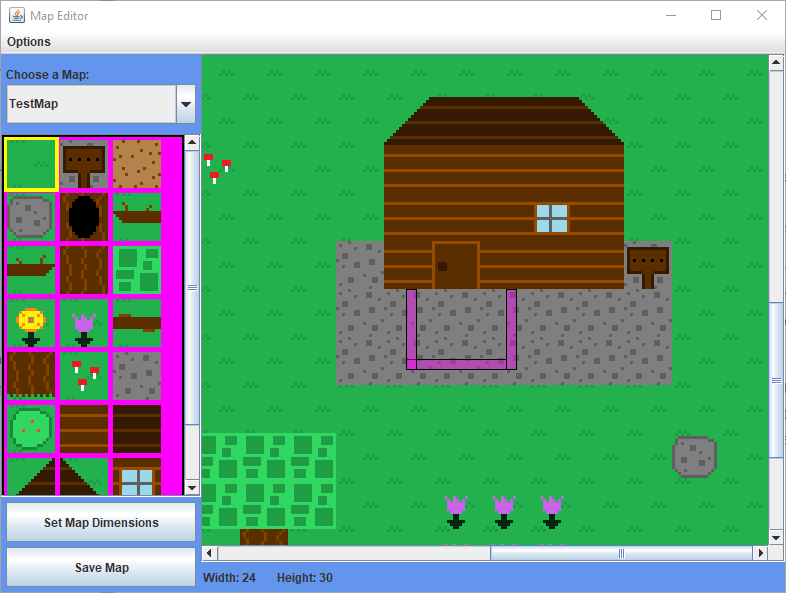
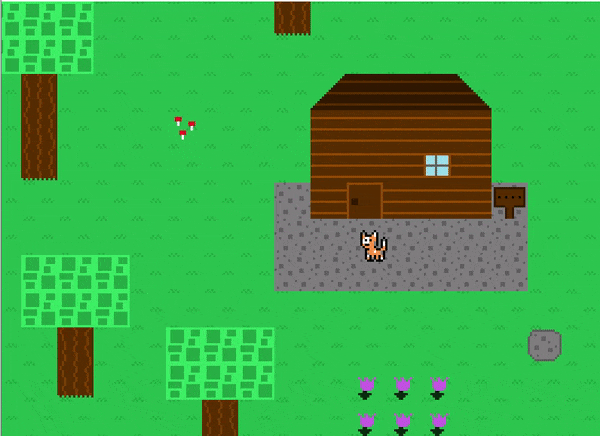
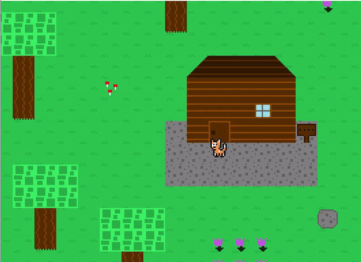

## Table of contents
{: .no_toc .text-delta }

1. TOC
{:toc}

---

# Triggers

## What is a trigger?

A trigger (represented by the `Trigger` class in the `Level` package) is a `MapEntity` subclass. 
For those that play a lot of video games, triggers are an extremely prevalent feature in nearly every genre that involves controlling a player around a map.
Their purpose is to act as a "trip wire" of sorts -- when the player walks on to a trigger, a certain event plays out.

Triggers are "invisible" -- the game doesn't draw anything to indicate that a trigger is there.
This allows them to be placed anywhere on the map, and trigger an event when the player walks over them without the player being aware of it.

Each trigger has an attribute for a `triggerScript`, which allows for the supplied script to be executed when the player walks over the trigger.
Read more about scripts [here](./scripts.md).

Each trigger also can optionally be supplied an `existenceFlag`, 
Triggers often use this feature to ensure they only are able to be triggered one time.
You can read more about flags [here](./scripts.md#Flags), and more about the existence flag [here](./map-entities.md#Existence Flag)

## How to create a trigger

The `Trigger` class is very simple. It just needs an x, y, width, and height to specify its location/size on the map,
a [script](./scripts.md) to act as its `triggerScript`, and an optional flag[./scripts.md#Flags] to act as its `existenceFlag`.
There is no real need to subclass them, as the trigger script is what essentially dictates what each trigger does; at their core,
they are just a rectangle with a script attached.

## Adding a trigger to a map

In a map subclass's `loadTriggers` method, triggers can be defined and added to the map's trigger list. For example, in `TestMap`,
a couple of triggers are added:

```java
@Override
public ArrayList<Trigger> loadTriggers() {
    ArrayList<Trigger> triggers = new ArrayList<>();
    triggers.add(new Trigger(790, 1030, 100, 10, new LostBallScript(), "hasLostBall"));
    triggers.add(new Trigger(790, 960, 10, 80, new LostBallScript(), "hasLostBall"));
    triggers.add(new Trigger(890, 960, 10, 80, new LostBallScript(), "hasLostBall"));
    return triggers;
}
```

The first four numbers are the trigger's "bounds" -- where it is located on the map (x, y) and how large it is (width, height).
The next argument is the specified `triggerScript`. Finally, the last argument (which is optional) is the `existenceFlag`.

## Triggers currently in game

Currently, the `TestMap` defines three triggers, which all perform the same script and have the same purpose.
They are placed around the player's house in a "horseshoe" like pattern to force the player to step on one
regardless of which direction they start walking in when the game starts up. Since all of them have the same `triggerScript` and `existenceFlag`,
they will all perform the same action when any one of them is triggered, and after triggering one, the `existenceFlag` will get set,
meaning all of them will get deactivated afterwards.

While triggers are invisible, the map editor will allow you to see them for help with placement. 
They are drawn as magenta rectangles with a black border. Below you can see the map editor showing where the triggers are located:



Note: You need to go to "Options" on the menu bar of the map editor and hit "Show Triggers" to see them.

From the above image, you can see the "horseshoe" shape I was referring to. Since each trigger is a rectangle,
I had to create three in order to make that shape. When the player walks over the trigger (which happens at the beginning of the game),
it executes the "lost ball script" (`LostBallScript` class which is in the `Scripts.TestMap` package).

In the below demonstration, the player walks over the "left" trigger, which causes it to execute its `triggerScript`.



You can read more about scripts [here](./scripts.md).

After setting off one of the three triggers, the other triggers will become deactive due to them all sharing the same `existenceFlag` which gets set after the `LostBallScript` ends.
It may seem like a lot of moving parts, but it is necessary in order to create a game of this genre.

Below is an example of the player walking over and setting off the trigger directly below, and then has the player
walking around showing that all three triggers will no longer be active afterwards.



This strategy allows for creating a larger "trigger" radius to force the player into activating one.